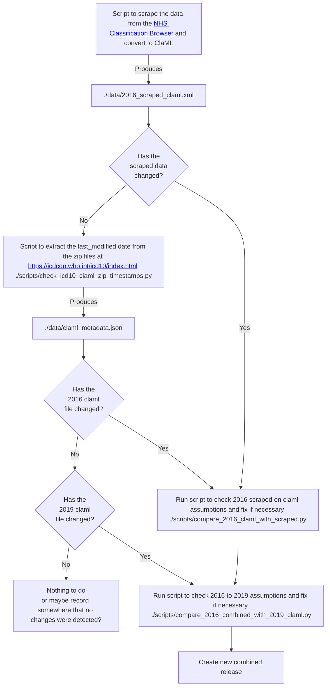

# ICD-10

ICD-10 is the tenth edition of the International Statistical Classification of Diseases and Related Health Problems, published by the WHO.

We previously imported the 2019 release of ICD-10, which includes COVID extensions as that was the most recent release at the time. However, we now create a combined edition release that includes the 2016 release with NHS modifications (the version used in admissions data in the NHS e.g. HES/APCS) and the 2019 release with COVID extensions (the version used in ONS deaths data).

Combining editions may require manual input. This document shows the step by step process for importing a new combined release of ICD-10.

## Steps

### 1. NHS Classification Browser Scraping

First we scrape the nhs modified 2016 data:

```bash
python -m coding_systems.icd10.scripts.scrape_nhs_classification_browser
```

The above command produces a ClaML file at `./coding_systems/icd10/data/2016_scraped_claml.xml`. Check if this has changed since the last time we ran this process (via git diff).
- if it has changed skip forward to [step 3](#3-check-2016-assumptions)
- if not, continue with the next step.

### 2. WHO ClaML file metadata check

Now we check if the base WHO claml files for 2016 and 2019 have changed since the last time we ran this process with the following script:

```bash
python -m coding_systems.icd10.scripts.check_icd10_claml_zip_timestamps
```

The above command produces a JSON file at `./coding_systems/icd10/data/claml_metadata.json`. Check if the file has changed since the last time we ran this process (via git diff).
- if the 2016 release has changed, proceed to [step 3](#3-check-2016-assumptions)
- if the 2016 release has not changed but the 2019 release has changed, skip forward to [step 4](#4-check-2016-to-2019-assumptions)
- if neither has changed, then there is no need to create a new release as there are no changes to the data, so you can stop here (TODO: or maybe record somewhere that no changes were detected?).

### 3. Check 2016 assumptions
We need to check the assumptions we make about the differences between the 2016 WHO ClaML file and the scraped file, and fix any issues if necessary. Run the following script to do this:

```bash
python -m coding_systems.icd10.scripts.compare_2016_claml_with_scraped
```

If there are any issues, then the above script will raise errors and guide you through the process of resolving conflicts. Once the script passes you can continue to the next step.

### 4. Check 2016-to-2019 assumptions
We need to check the assumptions we make about the differences between the combined 2016 WHO + NHS ClaML file and the 2019 WHO ClaML file, and fix any issues if necessary. Run the following script to do this:

```bash
python -m coding_systems.icd10.scripts.compare_2016_combined_with_2019_claml
```
If there are any issues, then the above script will raise errors and guide you through the process of resolving conflicts. Once the script passes you can continue to the next step.


### 5. Create the new combined release

We are now ready to create the new combined release with the updated data. Run the following script to do this:

```bash
# For local development
just manage import_coding_system_data icd10 ./coding_systems/icd10/data --release <release_name> --valid-from YYYY-MM-DD --import-ref <ref>

# For production
just manage import_coding_system_data icd10 /storage/data/snomedct/ --release <release_name> --valid-from YYYY-MM-DD --import-ref <ref>
```

- `release` is a short label for this coding system release - the version reference as described above.
- `valid-from` is the date that this release is valid from (NOT the date it is being imported into OpenCodelists), in YYYY-MM-DD format
- `import-ref` is an optional long-form reference field for any other potential references or comments on this import if desired.

TODO - once we know the naming convention we can replace some of the above placeholders with the actual values to make it easier to run the command.

After importing, restart the opencodelists app with:

```bash
dokku ps:restart opencodelists
```

## Process diagram


